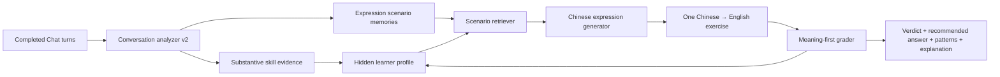

# English Learner V2：真实表达练习简化设计

> 实现状态：已于 2026-07-25 完成核心流程、历史场景接入、meaning-first 判题、简化 UI、旧事件兼容和本地自检；随后升级为每批一次生成 5 题、全部填写后一次统一判题。

## 1. 结论

English Learner 的产品形态收敛为一条主流程：

> 从用户的历史对话中选取一个真实、近期、值得复用的表达意图，以中文出题；用户用英文表达；系统按“意思是否完整、表达是否自然、语法和用词是否合适”判定，并给出推荐表达、常见句式和重点讲解。

前台只保留一种题型，不再展示或生成选择题、填空题、改错题、自由写作等题型，也不再针对大小写、纯拼写错误或纯格式问题安排练习。

后台可以继续保留事件记录、历史画像、复习调度和学习进度，但这些机制不应增加用户的操作和理解成本。

## 2. 为什么需要改

当前实现与目标有四个偏差：

1. `LearningQuestionType` 包含六种题型，出题器会在改错、改写、中译英、自由写作、填空和选择之间轮换。
2. 单次 session 的完成条件要求“至少答对两种不同题型”，这会反向强化多题型设计。
3. `mechanics.spelling` 和 `mechanics.capitalization` 是正式知识点，会进入画像、选题和掌握度。
4. 出题器只拿到当前知识点的一条 `sourceExcerpt`，并且 prompt 要求生成一个全新的中性场景。因此题目可能和某个语法弱点相关，却未必和用户近期真正想表达的内容相关。

V2 不应只把 `nextQuestionType` 固定为 `chineseToEnglish`。如果只改这一处，题型虽然少了，但历史相关性、判题体验和讲解结构仍然达不到目标。

## 3. 产品目标

### 3.1 必须做到

- 每道题都是中文表达意图，用户只需输入英文。
- 有足够历史时，绝大多数题目都能追溯到近期真实对话中的场景或表达意图。
- 接受多种自然译法，不要求匹配参考答案。
- 判题聚焦：
  - 中文意思是否完整表达；
  - 英文是否自然；
  - 语法是否影响表达；
  - 用词、搭配和语气是否合适。
- 纯大小写、明显手误式拼写和所有标点问题：
  - 不影响 verdict；
  - 不出现在问题列表；
  - 不进入知识画像；
  - 不触发后续专项练习。
- 判题后提供：
  - 一版推荐表达；
  - 可选的自然替代表达；
  - 2–4 个常见句式；
  - 针对本次答案的重点中文讲解。

### 3.2 不做

- 不做单词拼写训练。
- 不做大小写专项训练。
- 不做选择题、填空题和孤立语法题。
- 不做逐字翻译或唯一标准答案。
- 不为了展示学习系统的完整性而暴露题型、置信度、知识点百分比等内部指标。

## 4. 用户体验

### 4.1 Learn 首页

进入 Learn 后直接看到一批 5 题，不再先展示复杂的学习仪表盘。5 道题通过一次模型请求生成；用户全部填写后，通过一次模型请求统一判题。

```text
┌─────────────────────────────────────────────────────┐
│ 今日表达                                             │
│ 来自你最近的 Slack / 状态更新对话                    │
│                                                     │
│ 请用英文表达：                                       │
│ “这次发布先推迟到明天，我们还需要确认回滚方案。”     │
│                                                     │
│ [ 在这里输入英文……                              ]    │
│                                                     │
│ [换一个]                                  [提交]     │
└─────────────────────────────────────────────────────┘
```

设计约束：

- 不显示 “Question 1” 或题型名称。
- 不显示当前知识点和掌握度。
- “换一个”没有惩罚，不记录为失败。
- 默认不展示 Hint。若以后发现确实需要，只保留一个弱化入口“给我一个开头”，不恢复多种 scaffold 题型。
- session 可以继续作为后台技术边界存在，但用户只感知“下一批”和“先到这里”。

### 4.2 判题结果

```text
┌─────────────────────────────────────────────────────┐
│ 基本表达清楚，但有一处用词可以更自然                 │
│                                                     │
│ 你的表达                                             │
│ We need to delay the release to tomorrow ...        │
│                                                     │
│ 推荐表达                                             │
│ Let's postpone the release until tomorrow because   │
│ we still need to confirm the rollback plan.          │
│                                                     │
│ 关键问题                                             │
│ • delay ... to tomorrow → postpone ... until ...     │
│   表示“推迟到某个时间”，until 更自然地表达新时间点。 │
│                                                     │
│ 常见句式                                             │
│ • postpone + 名词 + until + 时间                     │
│ • We still need to + 动词                            │
│ • Let's ... because ...                              │
│                                                     │
│ 重点讲解                                             │
│ postpone 常用于发布、会议、决定等安排的延期……        │
│                                                     │
│ [先到这里]                                [下一题]    │
└─────────────────────────────────────────────────────┘
```

结果状态收敛为三个用户可理解的层级：

- **表达自然**：意思完整，表达自然；即使有纯拼写或大小写手误也属于此档。
- **基本正确**：意思完整，但有值得学习的语法、用词、搭配或语气问题。
- **需要调整**：漏掉关键意思、意思发生变化，或主要句子无法自然理解。

内部仍可保留 `ungradable`，但 UI 文案改为“这道题不够明确，换一道”，且不影响学习进度。

## 5. 历史对话相关性

### 5.1 当前缺口

当前历史分析只形成“知识点证据”，例如：

- articles；
- word choice；
- Slack politeness。

出题时只传入该知识点最近的一条摘录和纠正形式。系统知道“用户需要练介词”，但不知道用户近期反复在表达：

- 发布延期；
- PR review 跟进；
- incident 状态同步；
- 请求同事确认方案。

V2 增加独立的 **Expression Scenario Memory**。知识点回答“练什么能力”，场景记忆回答“围绕什么真实内容来练”。

### 5.2 数据来源

分析所有已完成的 Chat turn，而不只看当前的 `t` / `s`：

- `s`：优先级最高，通常直接包含真实工作表达意图和模型给出的英文版本。
- `t`：用于发现用户自己的英文表达、实质性问题和纠正后的自然说法。
- `translate`：可以提供用户近期关注的主题和常用表达场景，但不自动作为英文能力证据。

中文输入可以决定“练什么场景”，但不能作为用户英文水平好坏的证据。这个原则继续保留。

### 5.3 场景记忆

新增派生对象：

```swift
struct ExpressionScenarioMemory {
    let id: UUID
    let sourceTurnID: UUID
    let occurredAt: Date
    let intentZH: String
    let referenceEnglish: [String]
    let contextType: ExpressionContextType
    let topicTags: [String]
    let reusablePatterns: [String]
    let relatedKnowledgePointIDs: [String]
    let sourceMode: CommandMode
}
```

`contextType` 首版使用小而稳定的集合：

- status update
- request
- follow-up
- clarification
- disagreement
- incident
- planning
- review feedback
- general

隐私处理沿用本地优先原则：

- 人名、团队名、客户名、URL、ticket ID、密钥和代码片段必须删除或泛化；
- 保留表达意图，不保留完成练习不需要的业务细节；
- 练习题不逐字复制原句，而是保持同一意图并轻微改变细节。

### 5.4 选题策略

不需要首版引入向量数据库。历史量较小时，使用结构化标签和确定性打分更容易解释、测试和迁移。

候选场景分数：

```text
score =
  0.35 × recentness
  + 0.30 × weaknessMatch
  + 0.20 × recurrence
  + 0.15 × diversity
```

- `recentness`：近期对话优先，建议 90 天内线性衰减。
- `weaknessMatch`：场景能否自然练到当前高价值语法、用词或表达问题。
- `recurrence`：类似表达意图在历史中是否反复出现。
- `diversity`：避免连续出现相同 context、主题或句式。

内容配比：

- 历史足够时，至少 80% 的题来自历史场景记忆。
- 其中约 60% 是近期真实意图的变体，约 20% 是重复薄弱表达在相近场景中的迁移。
- 最多 20% 用于补足历史没有覆盖但确实重要的能力。
- 历史不足时明确显示“先做一题基础练习，之后会逐渐结合你的对话”，不伪装成个性化内容。

每道题内部保存 `sourceTurnIDs`，用于审计相关性和调试；UI 只显示脱敏来源标签，例如“来自你最近的状态更新对话”，不展示原始私密内容。

## 6. 出题设计

V2 的领域对象不再叫多题型 Question，而叫 Expression Exercise：

```swift
struct GeneratedExpressionExercise {
    let promptZH: String
    let situationZH: String
    let intentUnits: [String]
    let referenceAnswers: [String]
    let primaryKnowledgePointID: String?
    let secondaryKnowledgePointIDs: [String]
    let targetPatterns: [String]
    let sourceTurnIDs: [UUID]
    let sourceLabel: String
}
```

关键字段：

- `intentUnits`：中文表达中必须覆盖的意思单元，是后续判题的主要 rubric。
- `referenceAnswers`：2–3 个自然参考表达，防止模型把单一措辞当成唯一答案。
- `targetPatterns`：本题希望练到的常用句式，但不能要求用户逐字使用。
- `sourceTurnIDs`：保证每道个性化题都可追溯。

生成规则：

- 输出必须是简体中文表达意图，答案必须要求英文。
- 题目应是一到三句话，适合真实 Slack 或工作沟通。
- 和历史保持同一沟通意图，不复制敏感细节。
- 不生成考拼写、大小写或标点的题。
- 不生成只能靠猜测上下文才能回答的题。

## 7. 判题设计

### 7.1 判定维度

判题按以下顺序进行：

1. **Meaning coverage**：是否覆盖 `intentUnits`。
2. **Meaning accuracy**：有没有改变时间、否定、责任主体、确定性等关键意思。
3. **Naturalness**：是否像真实工作英语，而不是逐字中式翻译。
4. **Grammar**：语法问题是否真实存在并值得学习。
5. **Word choice / collocation / register**：用词、搭配和语气是否适合当前场景。

### 7.2 拼写和大小写策略

| 情况 | 处理 |
|---|---|
| `tomorow`、句首小写、`i` 没有大写 | 静默忽略；不降级、不展示、不记录 |
| 任何标点缺失或使用不规范 | 静默忽略；按最合理的表达意图判定 |
| `sea you tomorrow`，结合上下文可明确识别为 `see` 的手误 | 静默按 intended word 判定 |
| `discuss about the issue` | 属于搭配问题，需要讲解 |
| `I suggest to rollback` | 属于句式/动词搭配问题，需要讲解 |
| `information` / `informations` | 属于可数性和词形使用问题，需要讲解 |
| 一个疑似拼写错误导致意思无法确定，例如 `now` / `not` | 不标记为 spelling；按意思不明确处理，必要时判为需要调整 |

核心边界不是“字符串是否拼错”，而是“是否只是可明确恢复且不影响表达能力判断的手误”。只有影响语义、语法角色或真实用词选择时才作为学习问题。

### 7.3 新的结构化输出

```swift
struct GeneratedExpressionGrade {
    let verdict: ExpressionVerdict
    let meaningCoverage: Double
    let recommendedAnswer: String
    let alternativeAnswers: [String]
    let substantiveIssues: [ExpressionIssue]
    let patterns: [SentencePattern]
    let keyExplanationsZH: [String]
    let targetDemonstrated: Bool
    let followUpIntent: FollowUpIntent
}

struct ExpressionIssue {
    let category: IssueCategory
    let learnerFragment: String
    let suggestedFragment: String
    let explanationZH: String
}

enum IssueCategory {
    case missingMeaning
    case changedMeaning
    case grammar
    case wordChoice
    case collocation
    case naturalness
    case register
}
```

输出 schema 中不提供 spelling、capitalization、punctuation 类别，使模型无法把它们放进 `substantiveIssues`。

`patterns` 每次返回 2–4 个真正可复用的句式：

```swift
struct SentencePattern {
    let pattern: String
    let meaningZH: String
    let example: String
}
```

句式应来自本题的推荐表达和用户的实际问题，而不是返回泛泛的语法知识。

## 8. 学习画像和掌握度

### 8.1 保留，但退居后台

继续记录以下能力维度：

- grammar
- vocabulary
- expression
- pragmatics

`mechanics` 不再是可训练维度。已有 mechanics 事件保留在事件归档中，但：

- 不再生成新的 mechanics evidence；
- 不进入推荐 focus；
- 不显示在 Learn 页面；
- 不影响 V2 练习进度。

标点始终视为不训练的 mechanics。即使标点缺失或使用不规范，也不影响 verdict、不产生问题证据、不进入后续练习；判题器按最合理的表达意图理解答案。

### 8.2 单题型下的进度规则

移除“至少两种题型答对”的完成和 mastery 条件。改为：

- 一次表达练习即为一次 production evidence；
- 纯手误不降低本次 evidence；
- 至少跨两个不同场景正确表达，才提升为稳定掌握候选；
- 至少跨两个不同日期或在后续真实 Chat 中正确使用，才视为稳定；
- 后续真实对话再次出现同类实质问题时，重新进入复习队列。

这样仍然保留长期学习闭环，但不需要通过填空题和选择题制造“题型多样性”。

## 9. 数据兼容和迁移

当前 learning store 是只追加事件，不能直接删除旧题型枚举，否则旧事件重放会失败。

迁移策略：

1. 保留旧 `LearningQuestionType` case，仅用于解码历史事件，并标记为 legacy。
2. 新生成器只产生 V2 `ExpressionExercise`。
3. `LearningTaxonomy` 保留 mechanics 定义用于历史事件解码，但提供 `trainableDefinitions`，排除 mechanics。
4. analyzer、generator 和 grader 版本升级到 v2，确保已有 turn 可以按新规则重新分析时有明确版本边界。
5. 首次进入 V2 时：
   - 如果存在未完成的旧题型 session，追加一个“格式升级后结束”的 completion event；
   - 不把旧答案和成绩删掉；
   - 自动进入新的中文表达练习。
6. 新增 scenario projection，允许从现有聊天历史增量回填，不要求删除或重建整个数据库。

## 10. 技术流程



网络请求仍然保持最小化：

- 历史分析只发送尚未分析的新 turn，小批量进行；
- 出题只发送选中的脱敏场景和必要画像，一次返回 5 题；
- 判题只发送当前批次的 5 道题、rubric 和答案，一次返回 5 份独立反馈；
- 不发送完整聊天历史或完整事件归档。

## 11. 代码改造范围

### `MacTranslatorCore`

- `LearningTaxonomy.swift`
  - mechanics 改为 legacy/non-trainable；
  - 增加 active/trainable IDs。
- `LearningModels.swift`
  - 增加 scenario、expression exercise、expression grade 和 sentence pattern 模型；
  - 保留旧题型用于事件兼容。
- `LearningPrompts.swift`
  - history analyzer v2 同时提炼场景和实质能力证据；
  - generator v2 固定中文到英文表达；
  - grader v2 明确静默忽略 mechanics，并输出常见句式。
- `ChatHistoryStore.swift`
  - 提供所有 completed turn 作为场景来源；
  - 区分“可作场景来源”和“可作能力证据”。
- `LearningEngine.swift`
  - 移除题型轮换；
  - 增加场景检索和 source provenance；
  - 改为 meaning-first 判题；
  - 单题型下重写 session 完成条件。
- `LearningStore.swift`
  - 增加 scenario event/projection；
  - 画像投影忽略新 mechanics evidence；
  - 兼容旧事件并迁移未完成 session。

### `MacTranslatorApp`

- `LearnView.swift`
  - 首页直接进入表达练习；
  - 移除题型、Question 编号、置信度、知识点百分比和默认 Hint；
  - 新增推荐表达、常见句式、重点讲解。
- `LearningViewModel.swift`
  - 启动时完成 history catch-up 后自动取题；
  - “换一个”替代带惩罚语义的 Skip；
  - 保留取消、重试和断点恢复。
- `ChatViewModel.swift`
  - 所有 completed turn 都可触发场景增量同步通知；
  - 只有符合条件的英文输入进入 proficiency evidence。

## 12. 验收标准

### 12.1 产品验收

- 连续生成 20 道题，全部为中文到英文表达，没有其他题型。
- 有至少 10 条可用历史场景时，20 道题中至少 16 道可以追溯到历史场景。
- 连续题目不会逐字复制原始聊天中的敏感内容。
- 反馈固定包含推荐表达、常见句式和重点讲解。
- UI 不出现 spelling、capitalization、题型名称和 question type mastery。

### 12.2 判题回归

以下答案与正确拼写版本得到相同 verdict、相同 `targetDemonstrated`，且 issues 中没有相关内容：

- `we need to postpone it untill tomorrow`
- `we need to postpone it until tomorrow`
- `i think we should roll it back first`
- `I think we should roll it back first`

以下问题仍应识别：

- `discuss about`
- `suggest to rollback`
- `we need confirm`
- 漏掉中文中的“仍然”“先”“除非”“已经”等关键意思；
- 把可能性表达成确定性；
- 在 Slack 请求中使用明显不合适的强硬语气。

### 12.3 兼容性验收

- 旧 learning event archive 仍可完整重放。
- 旧 mechanics 数据不再出现在推荐题目和 Learn UI。
- App 在旧 session 中断后升级，不崩溃、不丢历史，并进入 V2 练习。
- 清空 Chat、重置学习进度和删除全部学习数据的现有语义保持一致。

## 13. 推荐实施顺序

1. 先改领域 contract 和兼容策略，固定唯一题型并排除 mechanics。
2. 增加 scenario memory 和历史回填，解决“高度相关”。
3. 上线 generator v2 和 grader v2，补齐句式与重点讲解。
4. 简化 Learn UI，让后台复杂度不再暴露给用户。
5. 用现有真实历史做脱敏抽样验收，再决定相关性打分权重是否需要调整。

这个顺序避免先做一个“只是把题型固定成中译英、但内容仍然泛化”的半成品。
