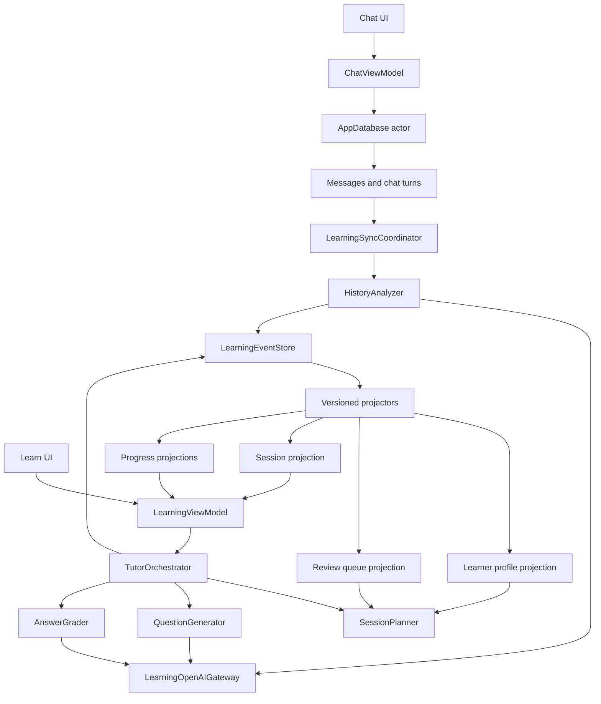

# Design: Personal English Teacher — Complete Event-Sourced Learning Loop

Generated by office-hours on 2026-07-25
Status: APPROVED
Mode: Builder
Owner: Personal use only

## 1. Problem Statement

Mac Translator already captures the user's real English usage through the `t` and `s` commands:

- `t`: English correction, explanation, and translation.
- `s`: Slack-oriented rewriting and communication feedback.

These records contain substantially better learning signals than a generic placement test because they expose:

- mistakes that recur in real communication;
- language the user actually needs at work;
- the gap between understandable English and natural English;
- changes in ability over time.

The new feature should turn those passive records into a continuous learning loop:

1. Observe new `t` and `s` usage.
2. Extract reliable evidence about weaknesses, strengths, and current ability.
3. Select the most valuable knowledge point to practise.
4. Ask one adaptive question at a time.
5. Grade the answer and explain it in Simplified Chinese.
6. Continue with a scaffold, retry, or harder variation as appropriate.
7. Record every learning fact.
8. Schedule later review and incorporate future real-world chat evidence.

The result should feel like a teacher who continuously knows what the user is struggling with, remembers previous teaching, and changes the curriculum as the user's real English changes.

## 2. Existing System and Constraints

The current macOS app is a native SwiftUI application with:

- `ChatView` and `ChatViewModel` for the current chat experience;
- `CommandParser` and `CommandMode` for `translate`, `correct`, and `slack`;
- `OpenAIClient` calling the Responses API;
- `ChatHistoryStore` persisting messages in SQLite;
- one local database at:

  `~/Library/Application Support/MacTranslator/chat-history.sqlite3`

The current `messages` table stores only:

- `id`
- `position`
- `role`
- `text`
- `mode`

Important current limitations:

- messages do not have timestamps;
- user and assistant messages do not share a turn/request ID;
- model and prompt versions are not recorded per turn;
- messages are paired only by their position in the list;
- `Clear` physically removes all source messages;
- every OpenAI request currently contains only the current message;
- the OpenAI client is designed for streamed plain text, not schema-constrained learning results;
- no learning profile, exercise history, mastery state, or review schedule exists.

The local database inspected during design contains 29 messages. It includes usable `t` and `s` records and one unmatched `s` user message. The migration therefore must support incomplete turns and must not assume every user message has an assistant response.

## 3. Product Premises

1. “Automatically load every time” means:
   - load the locally projected learner profile immediately;
   - find and analyze only new or outdated `t` and `s` turns;
   - never resend the entire chat archive on every session.

2. Only English written by the user is direct proficiency evidence.

3. Chinese input may identify useful topics, vocabulary, and work scenarios, but it must not be treated as proof of English ability.

4. Existing assistant corrections are useful context, but they are not unquestionable ground truth. A dedicated analyzer independently classifies evidence and records confidence.

5. Mastery is not a one-time model opinion. It requires deterministic rules, varied question formats, and delayed review.

6. “Mastered for this session” and “durably mastered” are different states.

7. Clearing chat history does not automatically clear the derived learner profile or learning progress.

8. Learning data is local-first, requires no account, and lives in the same logical SQLite database file.

9. The event log is the source of truth for learning. Current profile tables are disposable projections that can be rebuilt.

## 4. What Makes This Cool

The distinguishing experience is that normal work becomes the curriculum without requiring the user to maintain a vocabulary list or decide what to study.

The teacher can say:

> We are practising articles today because you omitted “the” in three recent Slack drafts. You fixed it in a fill-in-the-blank exercise last week, but you used it incorrectly again in real writing yesterday.

That explanation is possible because the system retains the chain of evidence rather than only a current score.

The system should also notice improvement:

> You previously struggled with past-tense negation, but your last four real messages used it correctly. I am moving it to maintenance and will check it again next month.

This closes the loop between practice and actual communication.

## 5. Recommended Product Experience

### 5.1 Navigation

Add a top-level segmented destination:

- **Chat**
- **Learn**

Chat remains focused on quick translation and polishing. Learning is a separate experience and does not introduce another command prefix.

### 5.2 Opening Learn

The Learn page loads in two stages:

1. Immediately show the last locally computed profile and any unfinished session.
2. In the background, display a concise sync state such as:
   - “Up to date”
   - “Learning from 4 new chats…”
   - “2 chats could not be analyzed; retry”

If new evidence changes the recommended focus before the first question is answered, the session planner may replace the planned topic. Once a question is shown, it remains stable.

### 5.3 Learn Home

The page should show:

- today’s recommended focus;
- a plain-language reason for selecting it;
- estimated session length;
- due reviews;
- recent improvement;
- current working-level summary and confidence;
- `Start session` / `Resume session`.

Example:

```text
Today's focus
Articles in workplace messages

Why this?
This appeared in 3 recent s messages and was still missed in your last free-writing exercise.

About 8 minutes · 2 reviews + 1 new variation
```

### 5.4 Question Loop

Only one question is active at a time.

Each question view contains:

- the question;
- the target scenario when useful;
- answer editor;
- `Submit`;
- `Hint`;
- `Skip`;
- a subtle indication of question type, not the exact grammar answer.

After submission, show:

- verdict: Correct / Acceptable / Needs improvement / Incorrect;
- the user's answer;
- a corrected or more natural version;
- concise Chinese explanation;
- the exact target concept;
- why this answer affected progress;
- the next action: retry, variation, harder question, or move on.

### 5.5 Adaptive Continuation

The session state machine decides:

- **Correct with strong evidence:** increase difficulty or change format.
- **Correct but used a hint:** give one unassisted variation.
- **Acceptable but unnatural:** explain the difference and test it in a new context.
- **Incorrect:** explain, scaffold, and offer a different question targeting the same concept.
- **Incorrect twice:** stop drilling, show a stronger explanation/example, schedule near-term review, and move on.
- **Ungradable or ambiguous:** ask a clarification or replace the question without penalizing progress.
- **Skipped:** record the skip but do not treat it as an incorrect answer.

The system must not trap the user in an endless loop. A single session can reach “good for today,” while durable mastery still requires a delayed review.

### 5.6 Session Completion

End with a compact teacher summary:

- what was practised;
- what improved;
- what still needs work;
- one example worth remembering;
- next scheduled review.

The user can end a session at any time. Partial progress is saved after every meaningful action.

### 5.7 Progress View

Provide:

- recurring issues;
- consolidating knowledge points;
- maintained strengths;
- due reviews;
- recent real-world improvements;
- weekly learning activity;
- working-level estimates by dimension.

Avoid a single falsely precise “English score.” Show dimensions:

- grammatical accuracy;
- vocabulary and collocation;
- sentence construction;
- naturalness;
- workplace/Slack pragmatics;
- technical communication clarity.

An optional CEFR-like working estimate may be shown with an explicit confidence label. It is not an exam result.

## 6. System Architecture



### 6.1 Core Components

#### `AppDatabase`

A single Swift actor owns database access, schema migration, transactions, and connection lifecycle.

This replaces scattered concurrent writes with one serialization boundary while retaining SQLite WAL mode and busy timeout.

#### `LearningEventStore`

Responsibilities:

- append immutable events;
- enforce unique idempotency keys;
- read events in sequence order;
- read an individual session or knowledge-point stream;
- expose the latest sequence number;
- support explicit permanent deletion of learning data;
- never silently update an existing event.

#### `LearningSyncCoordinator`

Responsibilities:

- discover completed `t` and `s` turns;
- identify missing or outdated analyses;
- batch incremental work;
- resume after cancellation or restart;
- ensure each source turn is processed once per analyzer version;
- append evidence events after schema validation.

#### `HistoryAnalyzer`

Classifies:

- input language;
- whether the turn is proficiency evidence;
- error evidence;
- correct-use evidence;
- vocabulary/topic interest;
- approximate level evidence;
- confidence and severity;
- minimal sanitized excerpts.

It does not update a mastery score.

#### `EventProjector`

Consumes events in increasing database sequence and builds disposable read models.

Every projector has:

- name;
- version;
- last processed sequence;
- rebuild operation;
- deterministic behavior.

If projector logic changes, increment its version and rebuild from event sequence zero.

#### `TutorOrchestrator`

Implements the learning state machine and is the only component allowed to advance a session.

#### `SessionPlanner`

Selects:

- target knowledge point;
- question type;
- difficulty;
- whether the next item is review, remediation, or new material.

Selection is deterministic given the profile, review queue, and session history.

#### `QuestionGenerator`

Uses a schema-constrained model response to create a question and grading rubric.

#### `AnswerGrader`

Grades open-ended answers against the stored rubric and target concept. It produces evidence; it does not directly declare permanent mastery.

#### `MasteryPolicy`

A versioned deterministic reducer that converts evidence events into current mastery, confidence, transfer stage, and review timing.

## 7. Database Design

All tables live in the existing logical database:

`~/Library/Application Support/MacTranslator/chat-history.sqlite3`

SQLite may continue to create temporary WAL/SHM companion files during operation.

### 7.1 Schema Management

Add:

#### `schema_migrations`

| Column | Purpose |
|---|---|
| `version` | Applied schema version |
| `applied_at` | Migration timestamp |
| `app_version` | App version that applied it |

### 7.2 Chat Source Tables

Retain `messages`, adding:

| Column | Purpose |
|---|---|
| `turn_id` | Stable link between user and assistant messages |
| `created_at` | Real creation time for new records |
| `origin` | `native` or `legacy` |

Add `chat_turns`:

| Column | Purpose |
|---|---|
| `id` | Stable turn ID |
| `mode` | `translate`, `correct`, or `slack` |
| `user_message_id` | Source message |
| `assistant_message_id` | Optional response message |
| `created_at` | Turn start |
| `completed_at` | Completion time |
| `status` | streaming/completed/failed/cancelled |
| `model` | Model used |
| `prompt_fingerprint` | Hash/version of the active prompt |
| `origin` | native/legacy |

The analyzer considers completed and failed turns with valid user text. An assistant response is optional.

### 7.3 Event Store

Add `learning_events`:

| Column | Purpose |
|---|---|
| `sequence` | Monotonic SQLite integer primary key |
| `event_id` | Globally unique UUID |
| `event_type` | Stable event name |
| `occurred_at` | Domain timestamp |
| `recorded_at` | Local persistence timestamp |
| `schema_version` | Payload schema version |
| `learner_epoch` | Reset boundary |
| `session_id` | Optional learning session |
| `knowledge_point_id` | Optional taxonomy target |
| `source_turn_id` | Optional source chat |
| `correlation_id` | Groups one workflow |
| `causation_id` | Event/command that caused this event |
| `idempotency_key` | Unique retry-safe command identity |
| `producer` | app/analyzer/grader/import |
| `model` | Optional model identity |
| `prompt_version` | Optional prompt contract version |
| `payload_json` | Versioned event payload |

Rules:

- rows are append-only during normal application behavior;
- `event_id` and `idempotency_key` are unique;
- unknown future event versions are quarantined, not silently ignored;
- text content is minimized and sanitized before persistence;
- explicit “Delete all learning data” may physically remove the store.

### 7.4 Projection Infrastructure

Add `projection_checkpoints`:

| Column | Purpose |
|---|---|
| `projector_name` | Unique projector |
| `projector_version` | Current logic version |
| `last_sequence` | Last applied event |
| `updated_at` | Health/debug timestamp |

Add disposable projection tables:

- `learner_dimension_projection`
- `knowledge_point_projection`
- `review_queue_projection`
- `learning_session_projection`
- `daily_progress_projection`
- `source_coverage_projection`

Projection rows may be updated because they are caches, not historical truth.

### 7.5 Knowledge Point Projection

Each knowledge point stores:

- taxonomy ID and display name;
- dimension;
- current mastery estimate;
- confidence;
- transfer stage;
- weighted evidence count;
- real-chat error count;
- real-chat correct-use count;
- practice success/lapse counts;
- last evidence time;
- last practice time;
- due time;
- current lifecycle state;
- explanation of why it is currently prioritized.

## 8. Event Taxonomy

### 8.1 Source and Analysis Events

- `source_turn_discovered`
- `source_turn_analysis_completed`
- `source_turn_analysis_failed`
- `error_evidence_observed`
- `correct_usage_observed`
- `learning_interest_observed`
- `level_evidence_observed`
- `analysis_evidence_superseded`

An analysis failure records operational metadata but no chat body in diagnostics.

### 8.2 Session Events

- `learning_session_started`
- `session_focus_selected`
- `question_presented`
- `hint_requested`
- `answer_submitted`
- `answer_graded`
- `explanation_presented`
- `question_retried`
- `question_skipped`
- `learning_session_paused`
- `learning_session_resumed`
- `learning_session_completed`

### 8.3 Control and Lifecycle Events

- `learner_profile_initialized`
- `learning_epoch_started`
- `taxonomy_version_changed`
- `mastery_policy_version_changed`
- `analysis_rebuild_requested`

Current mastery and review schedule remain projections derived from factual events. They are not treated as irreversible historical facts.

## 9. Error and Skill Taxonomy

Use stable hierarchical IDs, independent of UI wording.

### Grammar

- tense and aspect
- subject–verb agreement
- articles and determiners
- countability and plurals
- prepositions
- pronouns and reference
- negation
- modals
- word order
- clauses and conjunctions
- comparatives

### Vocabulary

- word choice
- collocation
- phrasal verbs
- idiomaticity
- technical vocabulary
- false friends / Chinglish transfer

### Expression

- sentence construction
- concision
- clarity
- ambiguity
- naturalness
- register

### Workplace Pragmatics

- Slack directness
- politeness
- requests and follow-ups
- disagreement and uncertainty
- incident/update communication
- audience appropriateness

### Mechanics

- spelling
- capitalization
- punctuation
- formatting

The taxonomy must be versioned. A model may suggest a subcategory, but only known IDs are accepted. Unknown categories are mapped to an approved parent and retained for later taxonomy review.

## 10. Evidence Model

Each evidence item records:

- target knowledge point;
- evidence kind;
- source: `t`, `s`, exercise, or later real chat;
- user input language;
- whether it is valid proficiency evidence;
- severity;
- analyzer confidence;
- communication impact;
- minimal source excerpt;
- normalized incorrect form;
- corrected form;
- Chinese explanation;
- opportunity type;
- model and prompt version.

### 10.1 Evidence Rules

- English `t` input: strong grammar and general writing evidence.
- English `s` input: strong grammar, naturalness, register, and workplace-pragmatics evidence.
- Chinese `t`/`s` input: learning-interest evidence only.
- Assistant output: supporting context, not ground truth.
- Absence of an error is not automatically correct-use evidence.
- Correct-use evidence is emitted only when the user actually had an opportunity to use the target construction.
- Low-confidence evidence may influence question selection but cannot by itself establish a weakness.

## 11. Ability Profile

The teacher maintains dimension-level estimates rather than one absolute score.

Confidence states:

- **Gathering evidence:** fewer than 10 eligible English turns.
- **Provisional:** 10–29 eligible turns.
- **Developing confidence:** 30–99 eligible turns.
- **High confidence:** 100+ varied eligible turns.

These thresholds are defaults and are versioned with the profile policy.

The current local history may produce an initial profile, but the UI must be willing to say “not enough evidence yet” rather than fabricate precision.

## 12. Mastery Policy v1

Mastery is deterministic and versioned.

### 12.1 Grading Outcomes

Normalize model output to:

- `correct`
- `acceptable`
- `needs_improvement`
- `incorrect`
- `ungradable`

Base observed scores:

| Outcome | Score |
|---|---:|
| Correct | 1.00 |
| Acceptable | 0.78 |
| Needs improvement | 0.42 |
| Incorrect | 0.00 |
| Ungradable | No update |

Adjustments:

- hint used: multiply by `0.65`;
- correct only after explanation/retry: multiply by `0.75`;
- skipped: no mastery change;
- analyzer confidence multiplies passive chat evidence;
- uncertain grading produces `ungradable`, never a penalty.

### 12.2 Evidence Strength

| Evidence type | Default weight |
|---|---:|
| Recognition / multiple choice | 0.35 |
| Fill-in-the-blank | 0.50 |
| Sentence repair | 0.65 |
| Guided rewrite | 0.75 |
| Chinese-to-English production | 0.85 |
| New-context free production | 1.00 |
| Confident correct use in later real chat | 1.10 |

Weights are capped before mastery calculation.

### 12.3 Update Rule

Start an unseen knowledge point at:

- mastery `0.50`;
- confidence `0.00`.

For a new piece of evidence:

```text
effectiveScore = outcomeScore × hint/retry adjustment
learningRate = clamp(0.12 + 0.18 × evidenceWeight, 0.12, 0.35)
newMastery = oldMastery + learningRate × (effectiveScore - oldMastery)
```

Recurring high-confidence errors add a lapse penalty based on severity and recency. Confidence grows with varied weighted evidence and decays slowly when the evidence is old.

All constants belong to `MasteryPolicy v1` and must never be changed in place. A new policy version rebuilds projections from raw events.

### 12.4 Lifecycle States

- `unobserved`
- `weakness_detected`
- `learning`
- `consolidating`
- `mastery_candidate`
- `maintained`
- `lapsed`

### 12.5 Durable Mastery Gate

A knowledge point becomes `maintained` only when all are true:

- mastery is at least `0.85`;
- at least three successful attempts exist;
- successes span at least two sessions;
- at least two question formats were used;
- at least one success is free production or confident real-chat use;
- at least one success occurred after a delay of three or more days;
- no recent high-confidence recurring error contradicts the result.

Maintained knowledge is still reviewed later. It is never permanently removed from consideration.

## 13. Review Scheduling

Initial interval ladder:

- same-session variation;
- 1 day;
- 3 days;
- 7 days;
- 14 days;
- 30 days;
- 60 days;
- 120 days.

Rules:

- incorrect twice in one session: explain and schedule next-day review;
- correct with hint: remain on the same interval step;
- correct without hint: advance one step;
- correct free production: may advance an additional step when confidence is high;
- later real-chat success may count as an incidental review;
- later real-chat recurrence causes a lapse and shortens the interval.

Review dates are projections from events and the versioned scheduler policy.

## 14. Question Strategy

Question difficulty progresses through:

1. recognize the correct form;
2. fill the missing form;
3. repair a sentence;
4. rewrite with guidance;
5. translate into a relevant English message;
6. produce a new Slack/workplace message freely;
7. demonstrate the skill later in real chat.

Session composition default:

- 70% due reviews;
- 20% recent real-chat weaknesses;
- 10% new or confidence-building material.

Constraints:

- introduce at most one new high-effort concept per short session;
- do not use the same question format more than twice consecutively;
- avoid copying the original chat sentence verbatim;
- preserve the user's real technical/work context while removing names, secrets, and sensitive identifiers;
- avoid trick questions;
- store an explicit acceptable-answer rubric because open-ended English often has multiple valid answers.

## 15. Model Contracts

Use separate versioned prompt contracts for:

### 15.1 History Analysis

Input:

- a small batch of new completed turns;
- mode;
- user input;
- optional assistant output;
- compact taxonomy;
- no unrelated historical archive.

Output:

- language classification;
- eligible proficiency evidence;
- error/correct-use evidence;
- severity and confidence;
- minimal sanitized excerpt;
- level evidence;
- learning-interest topics.

### 15.2 Question Generation

Input:

- selected knowledge point;
- current transfer stage;
- recent question types;
- sanitized evidence summary;
- desired workplace context;
- difficulty.

Output:

- question;
- type;
- target;
- expected concepts;
- grading rubric;
- acceptable alternatives;
- optional hint;
- concise rationale.

### 15.3 Answer Grading

Input:

- stored question and rubric;
- user's answer;
- target knowledge point;
- relevant context only.

Output:

- normalized verdict;
- confidence;
- detected issues;
- corrected/natural answer;
- Chinese explanation;
- whether target was demonstrated;
- suggested follow-up action.

Every contract uses schema-constrained structured output. Invalid output is retried or quarantined; it never changes progress.

Store model and prompt versions on resulting events so future analyses can be superseded or replayed safely.

## 16. Automatic Sync

### At app startup

1. Load projections locally.
2. Resume any unfinished projector work.
3. Discover unregistered `t`/`s` turns.
4. Queue background analysis when credentials and network are available.

### After a `t` or `s` request

1. Persist the completed/failed chat turn.
2. Append or enqueue `source_turn_discovered`.
3. Batch analysis after a short idle period rather than making an extra immediate request for every chat.

### On entering Learn

1. Perform a hard catch-up for all currently analyzable turns.
2. Show progress without blocking access to the previous profile.
3. Refresh projections.
4. Select or resume the next learning session.

### Batch limits

Use both:

- a maximum turn count per batch;
- a maximum character/token budget.

Large backlogs are processed in resumable chunks.

## 17. Idempotency, Recovery, and Consistency

### 17.1 Idempotency

Examples:

```text
analysis:{turnID}:{analyzerVersion}
question:{sessionID}:{ordinal}:{plannerVersion}
submission:{questionID}:{clientSubmissionID}
grade:{answerEventID}:{graderVersion}
```

The database rejects duplicate idempotency keys.

### 17.2 Durable Ordering

Events are ordered by database `sequence`, not wall-clock time.

### 17.3 Crash Recovery

Every user action is persisted before the UI advances:

- save `answer_submitted`;
- then request grading;
- then save `answer_graded`;
- then project and display.

If the app closes after submission but before grading, the session resumes by grading the saved answer. It never asks the user to retype it.

### 17.4 Projection Recovery

If a projection is missing, behind, or built with an old version:

1. mark it rebuilding;
2. clear only that projection;
3. replay compatible events from sequence zero or a verified snapshot;
4. atomically replace the projection;
5. update the checkpoint.

### 17.5 Analysis Corrections

Never edit old evidence. Append:

- new corrected evidence;
- `analysis_evidence_superseded` referencing the older event.

Projectors ignore superseded evidence while retaining audit history.

## 18. Privacy and Data Control

### 18.1 Local Storage

- raw chats remain in the existing local SQLite database;
- learning events and projections remain local;
- API Key remains in Keychain;
- diagnostics never log chat content, prompts, answers, or model output.

### 18.2 Minimized API Context

- send only new source turns for analysis;
- send only the selected knowledge-point context for questions;
- send only the current question, rubric, and answer for grading;
- never send the complete event log or complete chat history.

### 18.3 Derived Excerpts

Learning evidence may retain only the smallest pedagogically useful excerpt. The analyzer should:

- remove names;
- remove URLs;
- remove ticket/customer identifiers;
- remove code/secrets;
- cap excerpt length;
- prefer normalized patterns over full sentences.

### 18.4 Clear and Reset Semantics

**Clear Chat History**

- deletes `messages` and `chat_turns`;
- retains learning events and projections;
- clearly warns that derived learning examples remain.

**Reset Learning Progress**

- starts a new learner epoch;
- retains old events for audit;
- current mastery and sessions restart;
- previously extracted weaknesses may seed the new epoch only if explicitly chosen.

**Delete All Learning Data**

- physically deletes learning events, projections, and sanitized excerpts;
- leaves chat history untouched;
- is destructive and requires confirmation.

**Rebuild Learning Profile**

- leaves events untouched;
- recreates projections;
- is safe and useful after policy upgrades.

### 18.5 Export

Extend export with separate choices:

- chat history JSON;
- learning summary JSON;
- complete learning event archive JSON.

## 19. Legacy Migration

### 19.1 Message Migration

For existing rows:

1. preserve IDs, order, role, text, and mode;
2. add `origin = legacy`;
3. pair adjacent user/assistant rows of the same mode into a generated `turn_id`;
4. create an incomplete turn for unmatched user rows;
5. assign an inferred migration timestamp while preserving original order;
6. mark time confidence as inferred rather than pretending it is historical.

### 19.2 Initial Learning Import

After migration:

- discover legacy `t` and `s` turns;
- ignore ordinary translation mode for proficiency analysis;
- process turns incrementally using the same analyzer pipeline;
- retain the unmatched `s` turn as analyzable user input with a missing response;
- mark all initial evidence as legacy-source evidence.

### 19.3 Migration Safety

- migration runs in a transaction;
- make a timestamped database backup before the first schema migration;
- never delete the legacy schema/data until validation succeeds;
- projection construction occurs after source migration commits;
- migration is idempotent.

## 20. Failure Behavior

| Failure | Behavior |
|---|---|
| No API key | Show existing profile; explain that new analysis/questions need credentials |
| Offline during sync | Keep previous profile; retry later |
| Offline after answer | Preserve submitted answer and resume grading |
| Invalid analyzer output | Quarantine batch; no evidence change |
| Low-confidence grade | Mark ungradable; do not penalize |
| Assistant response missing | Analyze user English when possible |
| Projection behind | Show last consistent view plus “Updating” |
| Corrupt event payload | Stop affected projector, isolate sequence, preserve other data |
| User clears chat mid-analysis | Complete only if safe source snapshot exists; otherwise discard the analysis |
| User cancels generation | Do not create a question/grade event from partial structured output |

## 21. Testing Strategy

### Database and Migration

- migrate the current schema without losing messages;
- pair normal and incomplete legacy turns;
- repeat migration safely;
- verify Clear, Reset, Delete, and Rebuild semantics;
- verify unique idempotency keys.

### Event Store

- append and read in sequence;
- prevent normal event mutation;
- tolerate unknown future versions;
- verify correlation and causation links;
- ensure duplicate retries create one event.

### Projectors

- same event stream always produces the same projection;
- incremental projection equals full replay;
- projector version change triggers rebuild;
- superseded evidence is excluded correctly;
- reset epochs do not mix mastery.

### Mastery and Scheduling

- hint/retry weights;
- ungradable and skip behavior;
- durable-mastery gate;
- real-chat success and lapse;
- interval progression;
- no single answer can create durable mastery.

### Session State Machine

- start/resume/pause/end;
- correct/incorrect/acceptable branches;
- two-failure escape;
- answer saved before grading;
- crash between every state transition;
- no duplicate question after restart.

### Model Boundaries

- schema validation;
- unknown taxonomy IDs;
- prompt injection inside source chat;
- multiple valid English answers;
- Chinese input excluded from proficiency scoring;
- sensitive excerpts sanitized;
- invalid output cannot update progress.

### UI and Accessibility

- keyboard-only session;
- focus restoration;
- long explanations;
- loading and offline states;
- VoiceOver labels;
- empty and low-evidence profiles;
- progress survives app restart.

### Privacy

- no chat, question, answer, prompt, or API key in diagnostic logs;
- exported scope matches the selected export type;
- Delete All Learning Data removes derived excerpts.

The existing zero-dependency `MacTranslatorSelfTests` target can host deterministic core and migration tests. UI behavior may require an additional test strategy when full Xcode tooling is available.

## 22. Success Criteria

### Correctness

- every eligible turn is analyzed at most once per analyzer version;
- an app restart never loses or duplicates an answer, grade, or learning event;
- full replay produces the same projection as incremental processing;
- Clear Chat does not erase learning progress;
- Delete All Learning Data removes all derived learning content.

### Learning Quality

- every question can state which evidence caused it to be selected;
- no knowledge point becomes maintained from a single session;
- exercises progress from recognition to free production;
- recurring real-chat errors reopen previously maintained knowledge;
- Chinese source messages do not inflate proficiency estimates.

### User Experience

- the last profile appears immediately without a network call;
- entering Learn automatically catches up new history;
- one question is always clearly actionable;
- explanations are concise, specific, and in Simplified Chinese;
- the user can stop at any time without losing progress.

### Long-Term Outcome

After enough use, the app should report:

- declining recurrence rate for targeted errors in real chats;
- delayed-review success rate;
- movement from guided to free-production evidence;
- fewer hints and retries for maintained knowledge;
- confidence growth based on broader real usage.

## 23. Implementation Sequence

### Phase 1 — Database and Event Foundation

1. Introduce `AppDatabase` and schema migrations.
2. Add `chat_turns` and enrich messages.
3. Migrate legacy records safely.
4. Add `LearningEventStore`.
5. Add event serialization/versioning/idempotency tests.

### Phase 2 — Projection and Learner Profile

1. Implement projector infrastructure.
2. Add knowledge-point taxonomy.
3. Implement evidence/profile/review projections.
4. Implement `MasteryPolicy v1`.
5. Add replay and deterministic projection tests.

### Phase 3 — Incremental History Learning

1. Extend the OpenAI gateway for schema-constrained operations.
2. Implement versioned analysis contract.
3. Implement sanitization.
4. Implement automatic incremental sync.
5. Bootstrap legacy `t` and `s` records.

### Phase 4 — Tutor Loop

1. Implement planner and session state machine.
2. Implement question-generation contract.
3. Implement grading contract.
4. Persist every transition as events.
5. Implement adaptive retry and session completion.

### Phase 5 — Learn UI

1. Add Chat/Learn navigation.
2. Add Learn Home.
3. Add question and feedback states.
4. Add session summary.
5. Add Progress view.
6. Add sync/recovery/offline states.

### Phase 6 — Data Control and Hardening

1. Implement Clear/Reset/Delete/Rebuild semantics.
2. Extend exports.
3. Add migration backup and recovery.
4. Complete privacy, failure, and crash-recovery tests.
5. Validate the loop against the user's real history.

## 24. Risks and Mitigations

### Risk: Event sourcing becomes infrastructure-heavy

Mitigation:

- event-source only the learning domain, not every UI state;
- keep event payloads small and explicit;
- use one local database and one process;
- avoid distributed-system patterns such as brokers or networked event buses.

### Risk: Model analysis creates false weak points

Mitigation:

- confidence thresholds;
- independent evidence across multiple turns;
- known taxonomy only;
- low-confidence evidence can suggest a diagnostic question but cannot materially reduce mastery alone.

### Risk: The learner is over-drilled on one issue

Mitigation:

- two-failure escape;
- session variety constraints;
- at most one new difficult concept per short session;
- distinguish “good for today” from durable mastery.

### Risk: Sensitive Slack content is retained twice

Mitigation:

- event payloads store sanitized minimal excerpts, not full messages;
- clear UI explains derived-data retention;
- provide permanent deletion.

### Risk: Working-level estimates look more authoritative than the evidence

Mitigation:

- dimension-level estimates;
- visible confidence;
- insufficient-data state;
- no exam-equivalence claims.

## 25. Alternatives Considered

### A. Single-Prompt Learning Assistant

Smallest implementation. One model-driven flow reads new history and a progress file. Rejected for the long-term design because model output, mastery decisions, and state recovery would be too fragile.

### B. Structured Current-State Learning Engine

Stores current knowledge points, attempts, and reviews directly. Strong pragmatic option with lower effort. Not selected because overwritten state makes long-term re-analysis, explanation, and policy upgrades weaker.

### C. Complete Event-Sourced Learning Loop

Selected. Saves immutable learning facts and derives current state through versioned projectors. Highest initial effort, best auditability and long-term evolution.

## 26. Recommended Approach

Proceed with complete C, while keeping its boundary disciplined:

- the learning domain is event-sourced;
- existing chat remains a source record rather than converting the entire app to event sourcing;
- one SQLite database is used;
- model outputs are structured evidence;
- deterministic app policies own mastery and scheduling;
- projections make normal UI reads simple and fast.

## 27. Open Questions and Default Decisions

These questions do not block implementation unless changed:

1. **Default session size**
   - Default decision: approximately 8 minutes, usually 4–7 questions.

2. **Chinese `t`/`s` inputs**
   - Default decision: use them for topic/vocabulary relevance, never direct proficiency scoring.

3. **Derived source excerpts**
   - Default decision: retain sanitized fragments of at most 200 characters when they materially help teaching.

4. **Level display**
   - Default decision: show dimensions immediately, but show a CEFR-like label only after at least 10 eligible English turns and always include confidence.

5. **Background analysis timing**
   - Default decision: batch after idle time, guarantee catch-up on Learn entry, and never block Chat.

6. **Session language**
   - Default decision: questions primarily in English; instructions and explanations in Simplified Chinese; technical workplace context in English.

## 28. Next Steps

After design approval:

1. Freeze event names, payload schemas, taxonomy v1, and mastery policy v1.
2. Write database migration and replay tests before UI work.
3. Implement the event store and one minimal projector.
4. Import the existing local `t`/`s` history and inspect the resulting evidence.
5. Validate that the first recommended focus matches the user's own judgment.
6. Build one vertical slice:
   - sync one chat turn;
   - emit evidence;
   - select one knowledge point;
   - ask one question;
   - grade it;
   - restart the app;
   - resume with identical progress.
7. Expand to the complete adaptive loop only after the vertical slice is trustworthy.

## 29. What I Noticed

The strongest product decision in the request is using normal `t` and `s` behavior as the source of truth. The user did not ask for a generic course, a vocabulary deck, or an AI chat persona. The requirement was a full cycle of “understand my level, teach, record, and repeat.” That naturally favors a system that remembers evidence and learning history explicitly rather than relying on a long prompt or the model's conversational memory.

Choosing complete C also signals that long-term traceability matters more than shipping the smallest possible patch. The architecture should honor that choice without importing unnecessary distributed-system complexity into a single-user local Mac app.
